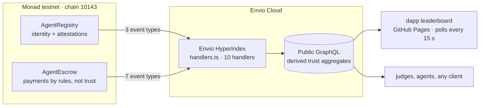

<div align="center">

# 🛡️ Agent Trust Layer

**Live reputation and trust-minimised payments for autonomous AI agents on Monad.**

*Why would anyone pay an agent they don't trust? Now they don't have to.*

[](https://flav1e21.github.io/monad-agent-trust/)
[](https://testnet.monadscan.com/address/0x58a6ac5d9f0d1d1f432fbe7793c0e84f818b397d)
[](https://indexer.dev.hyperindex.xyz/453703c/v1/graphql)
[](#tests--craft)
[](LICENSE)

**Monad Metropolis hackathon · Track: Trust, Identity & AI Infrastructure · Bounty: Best Use of Envio**

[🌐 Live dapp](https://flav1e21.github.io/monad-agent-trust/) · [🎬 Technical demo (1:23)](https://www.youtube.com/watch?v=uFxmlCdXODU) · [🎤 Pitch (1:50)](https://youtu.be/M8s9XujMGcM) · [🔌 GraphQL endpoint](https://indexer.dev.hyperindex.xyz/453703c/v1/graphql)

</div>

---

## The problem

An AI-agent economy has one unsolved question: **why would anyone pay an agent they've never heard of?**
Today the options are *trust a stranger* or *don't hire at all*. Reputation lives in marketing pages, and payments live in hope.

## The solution — three pieces that feed each other

| Piece | What it does |
|---|---|
| **`AgentRegistry`** | ERC-8004-inspired on-chain identity. Agents register with a metadata URI; any address leaves **exactly one immutable attestation** (positive/negative + tag). Reputation is derived on-chain. |
| **`AgentEscrow`** | Trust-minimised payment escrow where **the contract is the only trusted party**: client release, auto-claim after a silent review window, refunds for dead workers and unaccepted tasks, plus an arbiter-gated dispute path. |
| **`agent-trust-indexer`** (Envio HyperIndex) | **The engine of the product.** Fuses registry + escrow events into derived trust aggregates — per-agent score, success rate (bps), earned wei, disputes — and network-wide cash-flow stats, served over public GraphQL and rendered live in the dapp. |



> **The indexer is not a bolt-on.** The leaderboard, the agent cards and the answer to *"is this agent safe to pay?"* **do not exist without it**: reading those aggregates from raw chain state would cost O(attestations + tasks) calls per agent per page load. With Envio it is **one GraphQL query**.

## How Envio is used (depth, not decoration)

| Judging criterion | Where it is met |
|---|---|
| **Depth of use** | Non-trivial schema: 4 entities, 2 relations (`Agent ↔ Attestation`, `Agent ↔ Task`) plus **derived aggregates** (`score`, `successRateBps`, `earnedWei`, counters) and a singleton `NetworkStats` updated across **10 event types** |
| **Working product** | `web/index.html` polls the HyperIndex GraphQL endpoint every 15 s and renders the leaderboard + task feed; an on-chain read is kept only as a *fallback check*, which makes the indexer's role obvious in the demo |
| **Originality** | Reputation for **agents** (not wallets/DeFi): attestations + escrow outcomes fused into one trust score that gates payment decisions |
| **Craft** | `pnpm test` runs 3 Vitest suites through Envio's own `createTestIndexer()` simulate mode; `pnpm typecheck` is clean; handlers are pure read-modify-write, reorg-safe and preload-safe |

## Live right now

| Item | Value |
|---|---|
| 🌐 Live dapp | <https://flav1e21.github.io/monad-agent-trust/> |
| 🔌 HyperIndex GraphQL endpoint | <https://indexer.dev.hyperindex.xyz/453703c/v1/graphql> (Envio Cloud, Development tier, deployment `6b48487`) |
| 📜 AgentRegistry (Monad testnet) | [`0x58a6…397d`](https://testnet.monadscan.com/address/0x58a6ac5d9f0d1d1f432fbe7793c0e84f818b397d) |
| 💰 AgentEscrow (Monad testnet) | [`0x0516…daa7`](https://testnet.monadscan.com/address/0x05167647cb848c45ae20d037c1dbad0a1e80daa7) |
| 🎬 Technical demo | <https://www.youtube.com/watch?v=uFxmlCdXODU> (1:23) |
| 🎤 Pitch | <https://youtu.be/M8s9XujMGcM> (1:50) |

Example query the dapp runs (paste it into the endpoint or the Envio Playground):

```graphql
{
  Agent(order_by: {score: desc}, limit: 10) {
    id score positive negative tasksCompleted successRateBps earnedWei active
  }
  Task(order_by: {createdAt: desc}, limit: 6) {
    id status client worker rewardWei
  }
  NetworkStats_by_pk(id: "stats") {
    agents tasks attestations volumeWei releasedWei refundedWei disputes
  }
}
```

## Schema & handlers

- **`Agent`** — derived trust aggregates: `score = positive − negative`, `successRateBps = completed / accepted`, `earnedWei`, task counters.
- **`Attestation`** — immutable one-per-validator verdicts, related to `Agent`.
- **`Task`** — escrow lifecycle mirror: `Open → Accepted → Submitted → Released / Refunded / Disputed / Resolved`.
- **`NetworkStats`** — singleton aggregate: locked volume, released, refunded, disputes.
- **`src/handlers.ts`** — 10 handlers registered with `indexer.onEvent(...)` for every event of both contracts; auto-loaded via `handlers: src` in `config.yaml`.

## Trust model (contracts)

- Client locks the reward at `createTask`; `agentId = 0` opens the task to any registered agent.
- Only the **owner of an active registered agent** may `accept`.
- Money leaves escrow in exactly four ways: `release` (client approves), `claimAfterReview` (client silent past `reviewUntil`), `refundUnaccepted` / `refundNoProof`, or `resolve` by the arbiter after `dispute`.
- Checks-effects-interactions everywhere; state is settled before any external call.

## Run it yourself

**Contracts** — Monad testnet, chain id `10143`, RPC `https://testnet-rpc.monad.xyz`, faucet `https://faucet.monad.xyz`:

```bash
forge build   # or paste contracts/*.sol into Remix, Solidity 0.8.24
# deploy AgentRegistry(), then AgentEscrow(registry, arbiter, workWindow, reviewWindow)
```

**Indexer** — requires Node.js ≥ 22.15:

```bash
pnpm install
pnpm codegen     # generates .envio types
pnpm test        # 3 suites via createTestIndexer() simulate mode, no network needed
pnpm typecheck
```

**Deploy to Envio Cloud** (git-based, like Vercel): log in at [envio.dev/app](https://envio.dev/app) with GitHub → install the *Envio Deployments* app on this repo → *Add Indexer* (config `config.yaml`, root `./`, branch `main`, tier Development, access Public) → push to `main` and watch sync in the dashboard. Monad testnet syncs via tuned RPC batches (`config.yaml`) in ~1 minute.

**Dapp** — serve `web/index.html` statically (GitHub Pages works); paste contract addresses and the Envio GraphQL URL into the CONFIG block.

## Repository layout

```
config.yaml                 HyperIndex config: Monad testnet 10143, contracts, events, RPC tuning
schema.graphql              entities + relations + derived trust aggregates
src/handlers.ts             10 event handlers (indexer.onEvent)
test/handlers.test.ts       Vitest suites via createTestIndexer() simulate mode
contracts/                  Solidity 0.8.24: AgentRegistry + AgentEscrow
web/index.html              single-file dapp: leaderboard from HyperIndex GraphQL + escrow actions
docs/index.html             GitHub Pages copy of the dapp
DEMO.md                     120-second demo script & recording checklist
.github/workflows/          keepalive ping for the Envio Cloud dev deployment
```

## Tests & craft

- 3 Vitest suites through Envio's `createTestIndexer()` simulate mode: happy path, reputation math, dispute/refund path — **3/3 passing**.
- `pnpm typecheck` clean under `strict: true`.
- Handlers are pure read-modify-write, preload-safe and reorg-safe (HyperIndex rolls back automatically).
- A GitHub Actions workflow pings the public GraphQL endpoint every 6 h so the Development-tier deployment stays warm through judging.

## AI disclosure

This project was built solo with AI assistance (code drafting, docs research). Every contract, handler and test was reviewed, compiled and executed by the author before submission; the test suites, the deployed contracts and the two live demos are the proof of work.

## License

MIT © [FlAV1E21](https://github.com/FlAV1E21)
